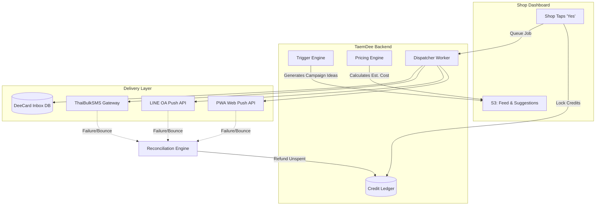
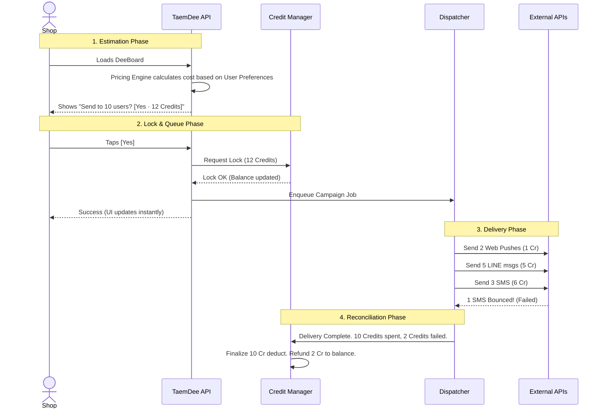

# DeeReach™ System Architecture

The DeeReach outbound messaging engine is the sole monetization driver for TaemDee. Because it directly handles shop credits and interacts with external paid APIs, its architecture is separated into distinct, isolated components to ensure zero "lost credits" and strict PDPA compliance.

Here is the best way to visualize and present the architecture to engineering and product teams.

---

## 1. High-Level Component Flow

---

## 2. Core Components

1. **Trigger Engine (Cron/Worker)**
   - Sweeps the database daily for milestones (e.g., Birthdays, "Almost There" at 8/10 points, "Win-back" for 60-day inactive).
   - Generates a pending `CampaignSuggestion` record for the shop.

2. **Pricing Engine (Estimator)**
   - When the shop loads DeeBoard, this engine evaluates the target segment for the suggestion.
   - It checks the `UserProfile` for each targeted customer.
   - **Logic:** `User.preferred_channel` ? Use it : Fallback to Waterfall (Web Push > LINE > SMS > Inbox).
   - Outputs a single aggregate `estimated_cost` to display on the `[Yes]` button.

3. **Credit Manager (Ledger)**
   - An immutable, append-only ledger tracking Shop THB top-ups and Credit spends.
   - Implements a **Hold/Lock** mechanism. Credits are not destroyed instantly; they are locked so the shop can't double-spend while the Dispatcher is working.

4. **Dispatcher (Background Queue)**
   - Processes the campaign asynchronously (e.g., using Celery or Redis Queue).
   - Batches external API calls to avoid rate limits from LINE or SMS gateways.
   - Routes the message payload strictly to the channel determined by the Pricing Engine.

5. **Reconciliation Engine**
   - Listens for webhooks or checks synchronous responses from the External Gateways.
   - If an SMS bounces or a Web Push token is expired, it calculates the cost of the failed message.
   - Issues a refund command to the Credit Manager, unlocking the unspent credits back to the shop's balance.

---

## 3. The Approval Sequence (How it works in practice)

This sequence diagram illustrates the exact flow of a shop owner approving a DeeReach campaign, ensuring they are never overcharged.

---

## 4. Key Architectural Safeguards
* **Zero UI Latency:** The shop owner never waits for the dispatcher. Tapping `[Yes]` locks the credits and updates the UI instantly. The actual delivery happens in the background.
* **No Bill Shock:** The Pricing Engine strictly caps the maximum cost. The Dispatcher is forbidden from spending more than the locked amount, even if user preferences change milliseconds before execution.
* **Idempotency:** The Dispatcher must ensure that a retry of a failed internal job does not double-send messages to the customer or double-charge the shop.
